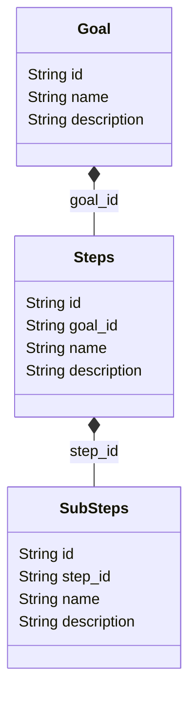

# Goal

The user <u><b>goal</b></u> is an entity created by the user to track progress toward a specific achievement. A <u><b>goal</b></u> can contain <u><b>steps</b></u> to be completed, which may also include <u><b>sub-steps</b></u>

## Relationships

The relationships between goals, steps and sub-steps shown on this diagram:

## Type definitions

Type definitions used for frontend and backend

### Goals

<<< ../../shared/types/goal.ts#goal

### Steps

<<< ../../shared/types/goal.ts#step

### Sub-steps

<<< ../../shared/types/goal.ts#subStep

## Database schemas

### Goals

<<< ../../server/db/schema/goal.ts#goal

### Steps

<<< ../../server/db/schema/goal.ts#step

### Sub-steps

<<< ../../server/db/schema/goal.ts#subStep
